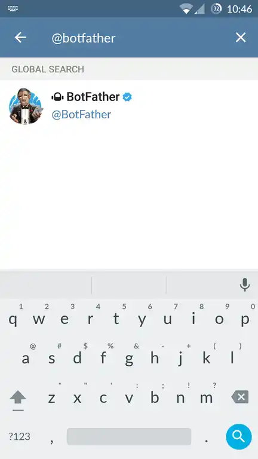

# cv4pve-botgram

```
   ______                _                      __
  / ____/___  __________(_)___ _   _____  _____/ /_
 / /   / __ \/ ___/ ___/ / __ \ | / / _ \/ ___/ __/
/ /___/ /_/ / /  (__  ) / / / / |/ /  __(__  ) /_
\____/\____/_/  /____/_/_/ /_/|___/\___/____/\__/

Telegram Bot for Proxmox VE (Made in Italy)
```

[](LICENSE.md)
[](https://github.com/Corsinvest/cv4pve-botgram/releases/latest)
[](https://github.com/Corsinvest/cv4pve-botgram/releases)
[](https://www.nuget.org/packages/Corsinvest.ProxmoxVE.TelegramBot.Api/)

---

## Quick Start

```bash
# Download latest release
wget https://github.com/Corsinvest/cv4pve-botgram/releases/download/VERSION/cv4pve-botgram-linux-x64.zip
unzip cv4pve-botgram-linux-x64.zip
chmod +x cv4pve-botgram

# Run the bot
./cv4pve-botgram --host=YOUR_HOST --username=root@pam --password=YOUR_PASSWORD --token=YOUR_TELEGRAM_BOT_TOKEN
```

---

## Features

### Core Capabilities

#### **Performance & Reliability**
- **Native C#** implementation
- **Cross-platform** (Windows, Linux, macOS)
- **API-based** operation (no root access required)
- **Cluster support** with automatic VM/CT resolution
- **High availability** with multiple host support

#### **Telegram Integration**
- **Full API access** via Telegram chat
- **Interactive commands** with real-time responses
- **Secure chat validation** with authorized chats only
- **Mobile management** from anywhere
- **Rich documentation** generated at runtime

#### **Proxmox VE Control**
- **VM/CT operations** (start, stop, shutdown, reset)
- **Node management** (shutdown, reboot)
- **API operations** (get, set, create, delete)
- **Usage monitoring** with detailed statistics
- **Alias commands** for custom workflows

#### **Enterprise Features**
- **API token** support (Proxmox VE 6.2+)
- **SSL validation** options
- **Multiple host** support for HA
- **Error resilience** with comprehensive logging
- **Check-Update** and upgrade capabilities

---

## Installation

### Linux Installation

```bash
# Check available releases and get the specific version number
# Visit: https://github.com/Corsinvest/cv4pve-botgram/releases

# Download specific version (replace VERSION with actual version like v1.2.3)
wget https://github.com/Corsinvest/cv4pve-botgram/releases/download/VERSION/cv4pve-botgram-linux-x64.zip

# Alternative: Get latest release URL programmatically
LATEST_URL=$(curl -s https://api.github.com/repos/Corsinvest/cv4pve-botgram/releases/latest | grep browser_download_url | grep linux-x64 | cut -d '"' -f 4)
wget "$LATEST_URL"

# Extract and make executable
unzip cv4pve-botgram-linux-x64.zip
chmod +x cv4pve-botgram

# Optional: Move to system path
sudo mv cv4pve-botgram /usr/local/bin/
```

### Windows Installation

#### Option 1: Winget (Recommended)

```powershell
# Install using Windows Package Manager
winget install Corsinvest.cv4pve.botgram
```

#### Option 2: Manual Installation

```powershell
# Check available releases at: https://github.com/Corsinvest/cv4pve-botgram/releases
# Download specific version (replace VERSION with actual version)
Invoke-WebRequest -Uri "https://github.com/Corsinvest/cv4pve-botgram/releases/download/VERSION/cv4pve-botgram-win-x64.zip" -OutFile "cv4pve-botgram.zip"

# Extract
Expand-Archive cv4pve-botgram.zip -DestinationPath "C:\Tools\cv4pve-botgram"

# Add to PATH (optional)
$env:PATH += ";C:\Tools\cv4pve-botgram"
```

### macOS Installation

```bash
# Check available releases at: https://github.com/Corsinvest/cv4pve-botgram/releases
# Download specific version (replace VERSION with actual version)
wget https://github.com/Corsinvest/cv4pve-botgram/releases/download/VERSION/cv4pve-botgram-osx-x64.zip
unzip cv4pve-botgram-osx-x64.zip
chmod +x cv4pve-botgram

# Move to applications
sudo mv cv4pve-botgram /usr/local/bin/
```

---

## Telegram Bot Setup

You don't need to write any code for this. In fact, you don't even need your computer! Go to the telegram app on your phone and…

### Step 1: Find BotFather

Search for the "botfather" telegram bot (he's the one that'll assist you with creating and managing your bot)



### Step 2: Create New Bot

Type `/help` to see all possible commands the botfather can handle


Click on or type `/newbot` to create a new bot.


### Step 3: Configure Your Bot

Follow instructions and make a new name for your bot. If you are making a bot just for experimentation, it can be useful to namespace your bot by placing your name before it in its username, since it has to be a unique name. Although, its screen name can be whatever you like.

**Example:**
- **Screen name:** "Frank Test PVE Bot"
- **Username:** "frank_test_pve_bot"

### Step 4: Get Your Token

Congratulations! You have created your first bot. You should see a new API token generated for it.

**Example token:** `707587383:AAHD9DVwXrBxz8wyOl0DWLdbzl8skkffhRo`

---

## Configuration

### Command Line Options

```text
Usage:
  cv4pve-botgram [options]

Options:
  --host <host> (REQUIRED)    The host name host[:port],host1[:port],host2[:port]
  --token <token> (REQUIRED)  Telegram API token bot
  --username <username>       User name <username>@<realm>
  --password <password>       The password. Specify 'file:path_file' to store password in file.
  --api-token <api-token>     Api token format 'USER@REALM!TOKENID=UUID'. Require Proxmox VE 6.2 or later
  --chatsId <chatsId>         Telegram Chats Id valid for communication (comma separated)
  --validate-certificate      Validate SSL Certificate Proxmox VE node.
  --service-mode              Run as background service (runs until stopped, no Enter key)
  --version                   Show version information
  -?, -h, --help              Show help and usage information
```

### Usage Example

```bash
# Basic usage (console mode)
cv4pve-botgram --host=192.168.0.100 --username=root@pam --password=YOUR_PASSWORD --token=707587383:AAHD9DVwXrBxz8wyOl0DWLdbzl8skkffhRo

# With Chat ID restriction (recommended)
cv4pve-botgram --host=192.168.0.100 --username=root@pam --password=YOUR_PASSWORD --token=707587383:AAHD9DVwXrBxz8wyOl0DWLdbzl8skkffhRo --chatsId=123456789,987654321

# Using API token (recommended)
cv4pve-botgram --host=192.168.0.100 --api-token=telegram-bot@pve!bot=xxxxxxxx-xxxx-xxxx-xxxx-xxxxxxxxxxxx --token=707587383:AAHD9DVwXrBxz8wyOl0DWLdbzl8skkffhRo

# Multiple hosts for HA
cv4pve-botgram --host=pve1.local:8006,pve2.local:8006,pve3.local:8006 --username=root@pam --password=YOUR_PASSWORD --token=707587383:AAHD9DVwXrBxz8wyOl0DWLdbzl8skkffhRo

# Service mode (background)
cv4pve-botgram --service-mode --host=192.168.0.100 --username=root@pam --password=YOUR_PASSWORD --token=707587383:AAHD9DVwXrBxz8wyOl0DWLdbzl8skkffhRo
```

---

## Deployment Options

### Console Mode (Default)

Run the bot in interactive mode. The bot will wait for you to press Enter to stop.

```bash
./cv4pve-botgram --host=pve.local --token=123456:ABC-DEF
# Bot is running. Press Enter to stop.
```

**Best for:** Development, testing, and debugging.

### Service Mode

Run the bot as a background service without console interaction. The bot will continue running until stopped with Ctrl+C.

```bash
./cv4pve-botgram --service-mode --host=pve.local --token=123456:ABC-DEF
# Bot is running in background. Press Ctrl+C to stop.
```

**Best for:** Production environments where you want the bot to run continuously.

### Windows Service with NSSM

For Windows systems, use NSSM (Non-Sucking Service Manager) to run the bot as a proper Windows service.

```powershell
# Download NSSM: https://nssm.cc/download
# Install the service
nssm install cv4pve-botgram "C:\path\to\cv4pve-botgram.exe" --service-mode --host=pve.local --token=123456:ABC-DEF

# Start the service
nssm start cv4pve-botgram

# View logs
nssm tail cv4pve-botgram

# Stop the service
nssm stop cv4pve-botgram

# Uninstall the service
nssm remove cv4pve-botgram confirm
```

### Linux Systemd Service

For Linux systems, create a systemd service file.

```ini
# Create service file
sudo nano /etc/systemd/system/cv4pve-botgram.service

# Add the following configuration
[Unit]
Description=Proxmox VE Telegram Bot
After=network.target

[Service]
ExecStart=/usr/local/bin/cv4pve-botgram --service-mode --host=pve.local --token=123456:ABC-DEF
Restart=always
User=proxmox

[Install]
WantedBy=multi-user.target

# Enable and start the service
sudo systemctl enable cv4pve-botgram
sudo systemctl start cv4pve-botgram

# Check status
sudo systemctl status cv4pve-botgram

# View logs
sudo journalctl -u cv4pve-botgram -f
```

### Service Mode vs Console Mode

| Feature | Console Mode (Default) | Service Mode (`--service-mode`) |
|---------|------------------------|--------------------------------|
| **Interactive Stop** | ✅ Press Enter to stop | ❌ Use Ctrl+C or system stop |
| **Console Output** | ✅ Full logging to console | ✅ Full logging to console |
| **Runs in Background** | ❌ Waits for Enter key | ✅ Runs until stopped |
| **Systemd Integration** | ⚠️ Limited | ✅ Full support with auto-restart |
| **NSSM Integration** | ⚠️ Limited | ✅ Full support with auto-restart |
| **Error Handling** | ✅ Exits on fatal errors | ✅ Exits on fatal errors |
| **Best For** | Development, Testing | Production, Services |

---

## Usage

In Telegram, open a chat with your bot and execute the `/help` command to see all available commands.

[Web Chat Telegram](https://web.telegram.org/#/)

### Available Commands

The bot provides direct access to Proxmox VE API through Telegram. Below is a partial list of common commands. Use `/help` in the bot to see the complete list of available commands.

- **/start** - Initialize bot and show welcome message
- **/help** - Show all available commands
- **/vm-start** - Start a VM or Container
- **/vm-stop** - Stop a VM or Container
- **/vm-shutdown** - Gracefully shutdown a VM or Container
- **/vm-reset** - Reset a VM or Container
- **/node-shutdown** - Shutdown a Proxmox VE node
- **/node-reboot** - Reboot a Proxmox VE node
- **/api-get** - Execute GET API request
- **/api-set** - Execute SET/PUT API request
- **/api-create** - Execute CREATE/POST API request
- **/api-delete** - Execute DELETE API request
- **/api-usage** - Show API usage and help
- **/alias-add** - Add new command alias
- **/alias-list** - List all aliases
- **/alias-remove** - Remove alias

---

## Support

Professional support and consulting available through [Corsinvest](https://www.corsinvest.it/cv4pve).

---

Part of [cv4pve](https://www.corsinvest.it/cv4pve) suite | Made with ❤️ in Italy by [Corsinvest](https://www.corsinvest.it)

Copyright © Corsinvest Srl