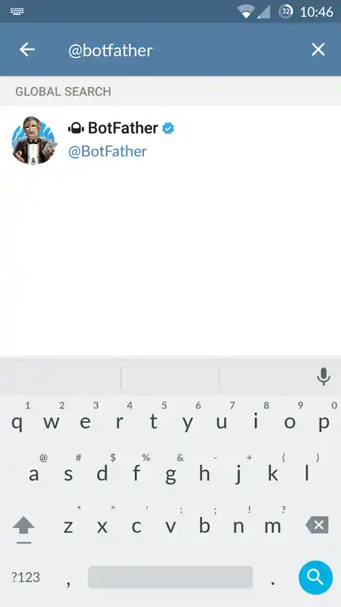
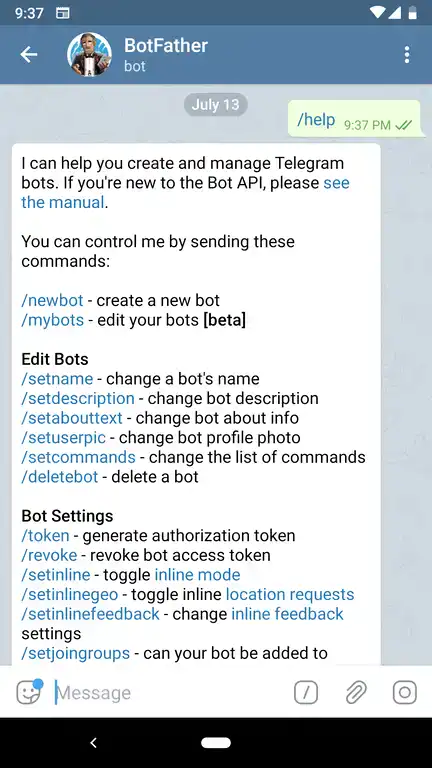

cv4pve-botgram needs a Telegram bot of your own: Telegram gives you its token, and the token is what
`--token` takes. Creating it needs no code and no computer, only the Telegram app.

## Create the bot

1. In Telegram, search for **@BotFather**, the official bot that creates and manages bots. Check the
   blue verified mark.

   

2. Open the chat and send `/newbot`. `/help` lists everything BotFather can do.

   

3. Answer its two questions:
   - the **name** shown in the chat list, e.g. `Datacenter PVE Bot`;
   - the **username**, unique in Telegram and ending in `bot`, e.g. `datacenter_pve_bot`.

4. BotFather replies with the **token**, a string like `123456789:AAH…`. Pass it to `--token`.

:::caution[The token is a password]
Anyone who has the token can run a bot with your bot's identity. Do not put it in scripts under version
control or in screenshots. If it leaks, send `/revoke` to BotFather: the old token stops working and you
get a new one.
:::

## Restrict the bot to your chats

A Telegram bot can be found and written to by anyone. `--chatsId` lists the chats cv4pve-botgram answers;
a message from any other chat gets `You not have permission in this Chat!` and is written to the log.
Without `--chatsId` every chat is accepted.

To find the ID of your chat:

1. Start the bot with an ID that matches no chat:

   ```bash
   cv4pve-botgram --host=pve01 --api-token='bot@pve!bot=<uuid>' --token='<telegram-bot-token>' --chatsId=0
   ```

2. Send any message to the bot from Telegram. It refuses you, and the console shows the ID:

   ```text
   10/01/2026 10:57:50 - Chat Id: '123456789' User: 'your_username' - 'Your Name' Msg Type: 'Text' => 'hello'
   Security: Chat Id '123456789' - Username 'your_username' not permitted access!
   ```

3. Stop the bot and start it again with that ID. Several chats are separated by commas:

   ```bash
   cv4pve-botgram --host=pve01 --api-token='bot@pve!bot=<uuid>' --token='<telegram-bot-token>' --chatsId=123456789,987654321
   ```

The chat ID decides who may talk to the bot; the privileges of the Proxmox VE token decide what the bot
may do. Keep both tight: see [Permissions](/cv4pve-botgram/permissions/).
